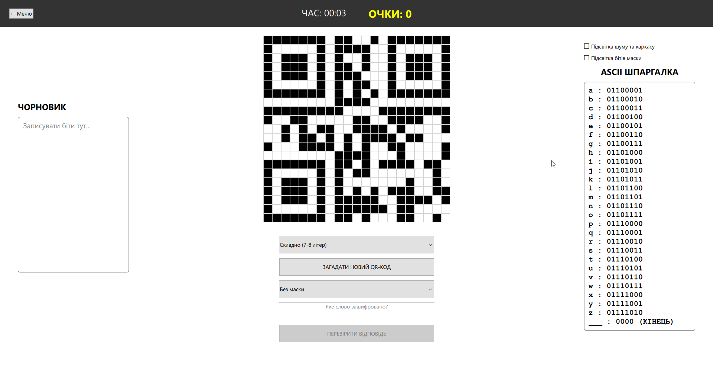

# QR Decoder Simulator

A cross-platform educational trainer that teaches you how QR codes work — by making you decode them manually.

Instead of scanning a code and getting an instant result, you go through the actual decoding process step by step: reading the pixel matrix, identifying the XOR mask, removing it, and converting binary sequences into ASCII characters.

---

## What it does

- Generates a 21×21 QR code matrix (Version 1) from a random word
- Three difficulty levels: Easy (3–4 letters), Normal (5–6), Hard (7–8)
- Interactive grid with visual helpers — highlight timing patterns, data zones, and XOR masks
- Built-in ASCII cheat sheet for binary-to-character conversion
- Score system based on time and wrong attempts
- Persistent stats: best time, best score, total wins

---

## How to run

1. Download the latest release archive from the [Releases](../../releases) page
2. Extract and run `QRDecoderSimulator.exe`
3. No installation required

> Built with Qt 6.11 — all required DLLs are included in the release archive.

---

## How to build from source

**Requirements:** Qt 6.x, C++17, CMake or qmake

```bash
git clone https://github.com/chaxluk/QR-code-decoder-simulator.git
cd QR-code-decoder-simulator
# Open the .pro file in Qt Creator and build, or:
cmake -B build && cmake --build build
```

---

## Tech stack

- **C++** — core logic: QR matrix generation, XOR masking, answer validation, scoring
- **QML / Qt Quick** — UI and all screens
- **Qt 6.11** — framework (cross-platform: Windows, Linux, macOS)
- **Architecture:** Model-View pattern (`QAbstractListModel` + QML `Repeater`)

---

## Screenshots

 

---

## License

[CC BY-NC 4.0](LICENSE) — free to use and learn from, commercial use is not permitted.
